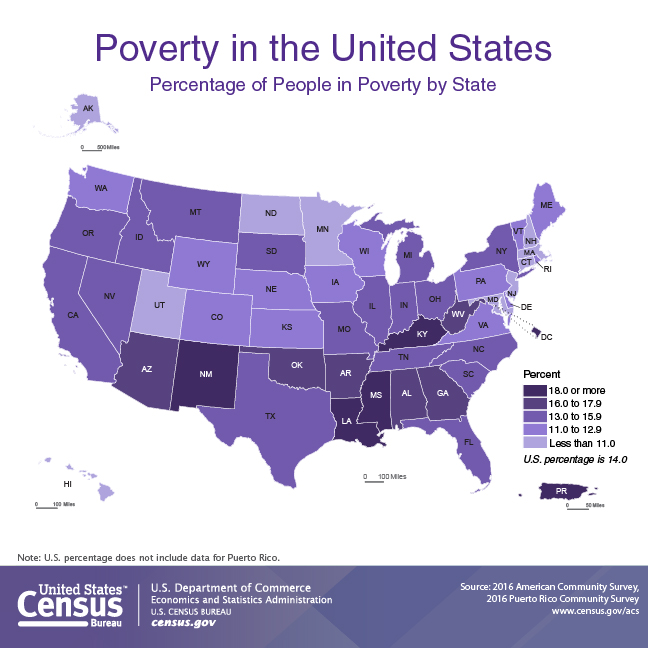

A new batch of census data shows poverty fell and incomes and health insurance coverage in Maine rose last year.

Those are good signs of progress on basic indicators of economic and general wellness, but Maine lagged progress nationwide. 

The data out early this morning from the Census Bureau includes a wide array of new data, but the best summary for Maine is here, in three data sets showing changes (and whether they were statistically significant) across multiple years. The full data were not up early this morning, but [links should work by 10 a.m.](https://www.census.gov/newsroom/press-releases/2017/acs-single-year.html) 

- [Economic characteristics](https://factfinder.census.gov/bkmk/table/1.0/en/ACS/16_1YR/CP03/0400000US23), including poverty, commuting trends and labor force data. 
- [Social characteristics](https://factfinder.census.gov/bkmk/table/1.0/en/ACS/16_1YR/CP02/0400000US23), including ancestry, the foreign-born population and divorce rates (male divorce is up).
- [Housing characteristics](https://factfinder.census.gov/bkmk/table/1.0/en/ACS/16_1YR/CP04/0400000US23), including year of construction, home values and heating fuels used (natural gas use is up). 

Those tables cover the basics, but there's still other ways to slice and dice the new release. Check out the Census [Fact Finder](https://factfinder.census.gov/faces/nav/jsf/pages/searchresults.xhtml?refresh=t) site and filter for the "2016 ACS 1-year estimates" to browse other tables.