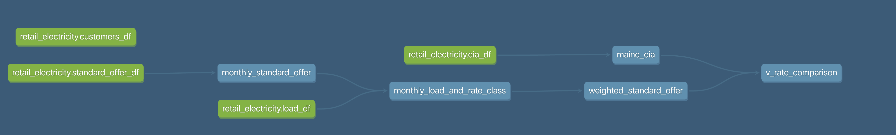

Some of the best things in journalism are the kinds of unique obsessions that come from working a specific beat for the right amount of time. The retail electricity supply market is one such obsession for me.

So, I've thought about that work a lot since 2022, when I stopped freelance reporting as part of my business intelligence work. Since, I've turned to rebuilding that data pipeline and front end with a dedicated project I'm much more easily able to maintain. 

I'm delighted to share the dedicated project page for this work, which puts some of the data in context. 

> [The project page: Maine's retail electricity ripoff](https://www.darrenfishell.website/retail-electricity/)

The backend is built with dlt and dbt and is currently run locally, producing a database in DuckDB that is ready for further analysis. The dbt lineage is much more straightforward. The primary lifting it does is transforming and generating a weighted standard offer average for a given year, based on kWh load for each of Maine's investor-owned utilities (Central Maine Power Co. and Versant's Bangor Hydro and Maine Public Service districts).

Standard offer data is not readily available from the PUC and is the only source that is manually compiled. Customer migration statistics and EIA files are parsed and loaded directly in the dlt pipeline. The lineage for the dbt project is below, which is fairly simple. 

The database is used directly in Observable data loaders upon deployment, with Github actions. The whole update of the process means the entire pipeline is much easier to maintain going forward.

Of course, I'm still partial to the ease of visualization development within Tableau, but the Observable and Plot frontend is much simpler, cleaner and snappier. 

I'm a fan of this entire stack for future development, but am inclined to use d3 directly for some of the more expensive preloads required in Observable Framework sites. If anyone has any optimization tips for improving that load time, let me know. 

Find all of the technical details [here](https://github.com/darrenfishell/retail-electricity).

