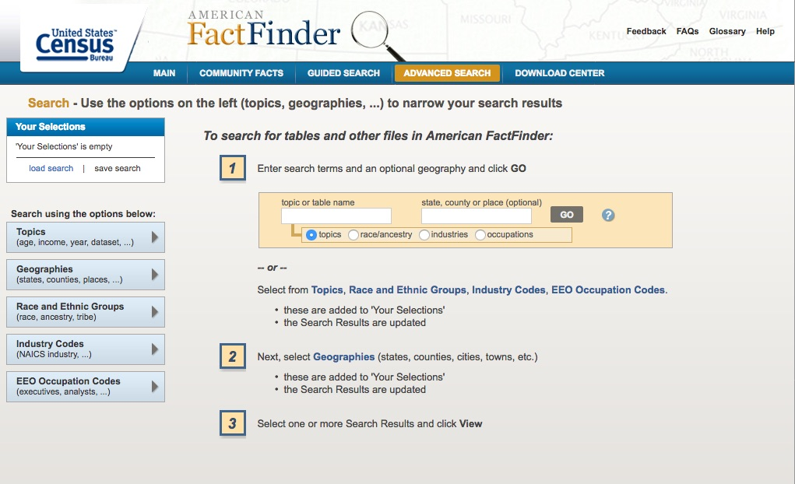
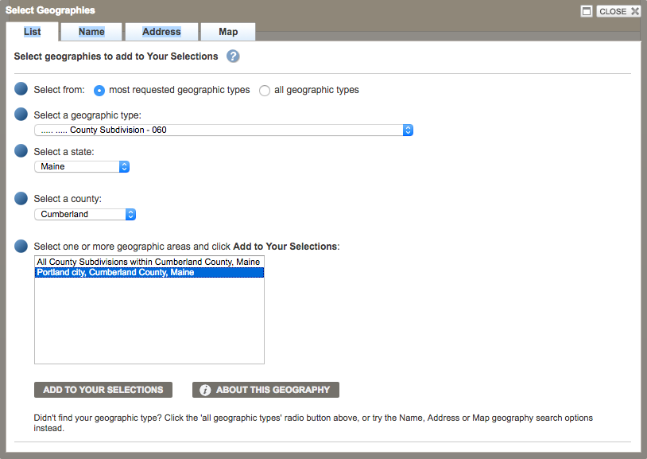
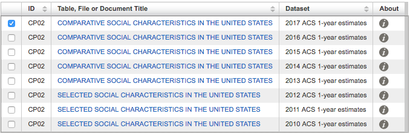
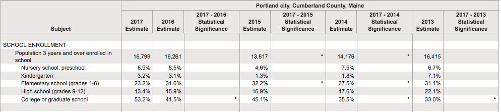
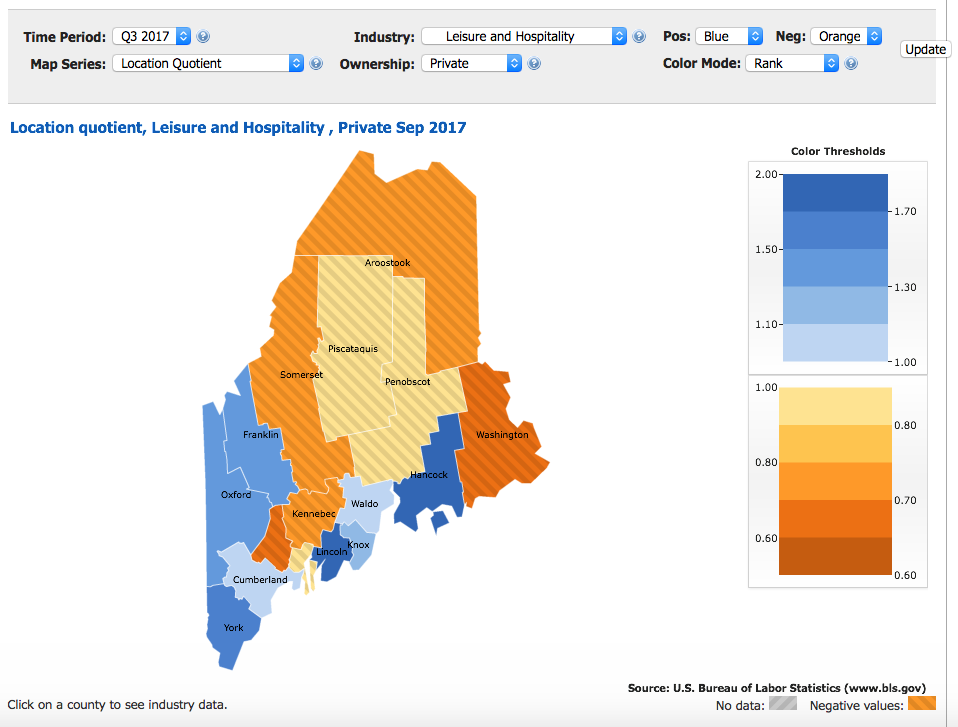

Before a reporter contacts any source, they need to understand why that person's in a position to know the answer to their question.

The same goes for data. So, the first step in data reporting is getting an introduction to some of the kinds of data that know things about your local beat, your county or state.

And there's plenty here for reporters on local beats to dig into. I think you'll be surprised at the kinds of insights you can extract at the local level, particularly because _not many other people are looking there._

That makes this kind of reporting good hunting ground for scoops, but it also empowers reporters to put hard facts up against rhetoric. It makes for strong follow-up questions and for a better understanding of the community you cover.

So, in super broad strokes, here are two federal data sources that can tell you quite a bit about your community, and a list of other data sources to explore.

### American Community Survey comparative tables

The U.S. Census Bureau's American Community Survey runs deep, based on surveys of U.S. households. For that, it's a data source that can confuse.

The bureau unraveled much of that confusion in a series of **four tables** that show you, very simply, what's up and what's down in a given area -- including quite small cities and towns.

At a glance, the tables show you where demographers think there's been a significant change. Are people in a given area getting older? Richer? Are there more vacant housing units? What's happened to the share of people with health insurance?

There's a ton here that could very well intersect with discussions in local or state government, which makes it a great place for a reporter to start. And it's a good introduction to the survey and its [FactFinder website](http://factfinder.census.gov/), which you should come to consider a familiar friend.

Here's how to quickly get to the tables you'll want.

* Navigate to  FactFinder's `Advanced Search` page, on the top navigation bar. (If you do more inquiring of the ACS, you should become familiar with this page, which _isn't as scary as it may look_.)

The page lets you place filters on all of the data ACS keeps, narrowing down the topics and geographies you want. Generally, you can perform a text search in the `Topic or table name` field information.

* In this case, we want to look for four specific tables, by their table IDs. They are:

  * `CP02`: Selected social characteristics
  * `CP03`: Selected economic characteristics
  * `CP04`: Selected housing characteristics
  * `CP05`: Selected demographic characteristics

* Type any of those IDs into the search bar and press enter, adding it to the `Your Selections` pane, at the top left.

This will show the various years and surveys for which these statistics are available. That will include surveys that cover different spans of time. For instance, the `1-year estimates` are based on household surveys taken in just one year.

For less populous areas, the ACS uses five years of survey data to generate more accurate estimates.

This raises concerns in comparing changes from one period to another, but the comparative tables already do this work for you, which makes them a great place to start.

* Next, narrow down your geography by clicking the `Geographies` box in the left sidebar. In the dropdown, select the desired area.

To find cities, towns and other communities, pick `County subdivision`. Follow the rest of the steps to narrow down your geography. I'll go with my town, Portland, Maine.

* Click `Add to your selections`

That will show you the available surveys. We'll look at the most recent figures, based on 2017 surveys.

The table is relatively easy to read, showing changes in estimates from one period to another and -- most importantly -- whether that change was statistically significant, signaled by asterisks.

That means the demographers are almost certain that the change is not due to chance, but an actual change among the population.

That's of critical importance in reporting whether something has really changed and it should be the first column you analyze, showing where demographers are confident that something has really changed.

In the case of Portland, for instance, there's an interesting trend of people heading back to college or graduate school. Is historically low unemployment and a growing job market affecting those figures? What will the implications be for students exiting school with new debt?

The trend could easily fit into the background of local stories on a range of topics, or could make for the start of a story about other local trends.

There are other gems tucked away in the other tables, too, which I'll leave you to explore.

### Quarterly Census of Employment and Wages

This data set isn't used nearly enough, IMHO. Why? It's an actual _census_ of all jobs in an area, meaning there aren't margins of error with the data.

It can show you real changes in payroll jobs in an area, broken out by certain industries and even showing average wages for jobs in those industries.

Most interestingly -- I think -- it can show you how your local or state economy compares with the national economy, at a glance.

That information can very easily fit into a local story about everything from economic development incentives to the job market.

The U.S. Bureau of Labor Statistics [provides a nice web application to explore the data](https://beta.bls.gov/maps/cew/us).

To compare a county or state economy to the nation:

* Click on a state in the map.
* Select `Location quotient` in the dropdown menu for `Map series`.
* Select an industry and a time period.

The resulting view will show you where that industry is more or less concentrated than the country as a whole. For instance, in the image below, you can see the Maine counties in blue depended more on private sector jobs in leisure and hospitality than the country as a whole.

The location quotient compares those things with a fairly simple formula, comparing the local share of jobs in that industry to the national share. The formula looks like:

`([Local jobs in industry]/[All local jobs]) / ([National jobs in industry]/[All national jobs])`

There are plenty of other ways the QCEW can be useful to local business or economy stories, as the data set gets much richer and deeper than this.

But, with data reporting, there's _always_ a catch or two. It's essential to know with each data set, what those are.

Mostly, it's important so that you can better hone your questions and enter your investigation of the data with the right expectations.

In the case of the QCEW, there are a few: The data isn't adjusted for seasonal changes in certain industries, so one should not necessarily make a big deal about a surge in, say, hospitality and accommodation jobs from Q2 to Q3 in Maine.

Looking at rolling yearly numbers or comparing a quarter to the same quarter one year ago -- rather than the previous quarter -- can address that problem.

The pay data is also unadjusted, not accounting for inflation.

There are still other cautions:

* The data does not count people who are self-employed. Basically, it's everyone who has a boss.
* It also doesn't separate out full- and part-time jobs. That makes it harder to compare average wages across industries, since industries with a greater share of part-time workers will, naturally, be lower.
* And the data is based on where employers are located, not where employees live. That tempers how one might interpret positive trends in a metropolitan area, as those jobs could be held by people who live in the suburbs.

Still, the data provides some of the best look at economic trends at a very local level.

Maine's Department of Labor happens to put that data on good display, in a dashboard using the software Tableau.

<noscript></noscript><object class='tableauViz'  style='display:none;'><param name='host_url' value='https%3A%2F%2Fpublic.tableau.com%2F' /> <param name='embed_code_version' value='3' /> <param name='site_root' value='' /><param name='name' value='IndustryEmploymentandWages_8&#47;Maine' /><param name='tabs' value='yes' /><param name='toolbar' value='yes' /><param name='static_image' value='https:&#47;&#47;public.tableau.com&#47;static&#47;images&#47;In&#47;IndustryEmploymentandWages_8&#47;Maine&#47;1.png' /> <param name='animate_transition' value='yes' /><param name='display_static_image' value='yes' /><param name='display_spinner' value='yes' /><param name='display_overlay' value='yes' /><param name='display_count' value='yes' /></object>
                

That dashboard lets one dig down into the data at a very local level. That is [available through the Bureau of Labor Statistics, too](https://www.bls.gov/cew/data.htm), but it requires some searching to get data that's as comprehensive as what the Maine Department of Labor has packaged together.

### Other data sources

Learning to use the federal data sets above is just a start. There's a whole universe of federal and state data sources that can help inform local stories.

If you're curious about what's available and what questions you might better answer in your reporting with data, that's all you need to get started. And discovering new sources is an ongoing process.

The best single place to do that is the email newsletter produced by Buzzfeed News data reporter Jeremy Singer-Vine, called Data Is Plural. His [archive of data sources linked in the newsletter is a must-see](https://docs.google.com/spreadsheets/d/1wZhPLMCHKJvwOkP4juclhjFgqIY8fQFMemwKL2c64vk/edit#gid=0), and it will help spark a bunch of ideas for stories or resources to bookmark for later.

Here are just a handful of other data sources that I've found invaluable for stories on my beats, revolving around business, politics and energy.

- State-level campaign finance: [The National Institute on Money in State Politics](https://www.followthemoney.org/)
- Federal campaign finance: [The FEC's new campaign finance site](https://www.fec.gov/data/) and [ProPublica's FEC itemizer](https://projects.propublica.org/itemizer/)
- The power grid: [The U.S. Energy Information Administration's Electricity Data Browser](https://www.eia.gov/electricity/data/browser/).
- Economic development subsidies: [Good Jobs First's Subsidy Tracker (2.0)](https://www.goodjobsfirst.org/subsidy-tracker-2#/)
- Nonprofit financials: [ProPublica's Nonprofit Explorer](https://projects.propublica.org/nonprofits/)
- International trade statistics (available at state and port levels): [U.S. Census Bureau's USA Trade Online](https://usatrade.census.gov/)
