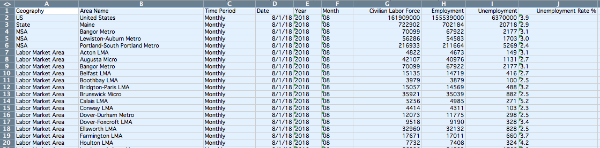
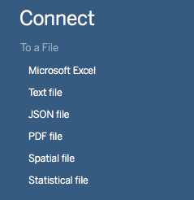
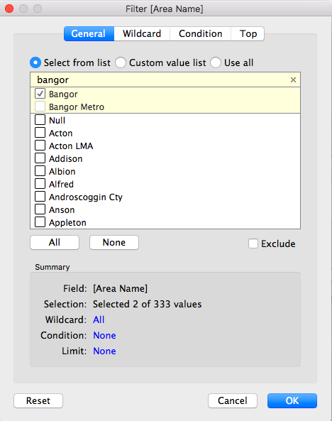

After you've found data relevant to your reporting, you have to figure out what role it's going to play.

Is the story all about the data, is it context? Is it an anchor graphic, an interactive, or just a summary fact that sets up your story?

To answer that question, it helps to have some familiarity with the available data tools, to know just how you might get from raw data to some conclusion or a publishable graphic.

There are plenty of tools that can help, without any coding.

The best single tool I've found is [Tableau Public](https://public.tableau.com/en-us/s/), which is free to download and publish to the web. That has been the backbone of most of the data journalism I've done, with no coding required.

There are plenty of other ways to get started, too, from Google Sheets to Excel.

But Tableau offers a lot more in the way of analysis and, most importantly, it reduces the pain of screwing up and it lets you tinker with an analysis or visualization.

Here's an example (for which you can download Tableau Public and follow along), where we'll take a somewhat frightening data set and distill it down to something more palatable.

### Tracking annual unemployment in Bangor

We'll use here a batch of data kept by the Maine Department of Labor, and published on their page for [labor force statistics by geography](https://www.maine.gov/labor/cwri/laus2.html).

You can download that [directly from the state site, in an Excel file](https://www.maine.gov/labor/cwri/data/laus/Excel/LAUS_County_LMA_Town_NSA.xlsx) or in this comma-separated file I've archived -- [right-click and `save as`](https://github.com/darrenfishell/darrenfishell.github.io/raw/master/data/LAUS_County_LMA_Town_NSA.csv)

The first step is taking a look at the data in your preferred viewer -- Excel, Google Drive, OpenOffice, etc.

The file is relatively large and, if you're new to such data sets, it's entirely unreadable to the human eye. But it's readable to a computer -- or, it's machine-readable.

And that's :100:.

Here, the columns are a guide to how we'll be able to slice and dice the data: we can look at it by time period of the data (we'll want `Annual`, not `Monthly`) and geography (we can use the `Geography` and `Area Names` field to home in on the right data).

So, we'll fire up Tableau and load that data in.

### Analyzing the data

At the top left of the first screen in Tableau, you'll see the options to connect to data. If you downloaded the CSV file, hit `Text file` and navigate to where you saved that file. If you downloaded from the state page, hit `Microsoft Excel`.

Before you get to making a visualization in Tableau, the program lets you preview and prepare the data, row-by-row.

This is where we can winnow down the relatively large data set into something more specific to our question, filtering out all the information we don't need.

Up a the top right, hit the `Add` link under the `Filters` label. In the window that pops up, click the `Add` button.

This is where you want to think about what questions you want to answer, and how you might want to explore the question of Bangor's unemployment rate.

While looking at that rate over time will reveal something to us, it's helpful to have something to compare, like the state average. So, we'll keep in the state numbers in our filtering.

Here's how we do that, applying the following filters:

* `Area Name`: Use the text search bar to find and select `Bangor` and `Maine`.
* `Time Period`: Select `Annual`

Just these two filters have brought us down to 50 rows of data, distilling things down to help us answer a pretty specific question.

We're ready to move onto seeing what the data has to show us, in a Tableau worksheet. At the bottom of the Tableau window, click `Sheet 1` to enter that view.

Tableau will show us all of the columns of data that are available to us, organized as dimensions and measures.

`Date` and `Area Name`, for instance, are dimensions along which we can view the measure, `Unemployment Rate %`.

The interface is entirely drag-and-drop here, or we can highlight the fields we want and have Tableau suggest what we might want to see.

Hold the `Shift` key while selecting `Date`, `Area Name` and `Unemployment Rate %`. In the top right corner, select the `Show me` button and Tableau will suggest a line chart.

Putting that onto the view, you can see Bangor-specific data only goes back to 2010, while state-wide unemployment rates go back to 1976.

We can filter the data even more here, limiting that to just rates since 2010, by dragging the `Date` field to the box, or pane, that says `Filters`, at the top left.

We want to filter for individual years, selecting 2010 to 2017.

It's important to note here that Tableau has two ways of looking at a column of data -- either as a `continuous` or a `discrete` value.

>Continuous means "forming an unbroken whole, without interruption"; discrete means "individually separate and distinct." (For this and many other things, [Tableau's online forums are a huge help](https://onlinehelp.tableau.com/current/pro/desktop/en-us/help.htm#datafields_typesandroles.html%3FTocPath%3DGet%2520Started%7CTableau%2520Concepts%7C_____1).)

Dates or fields of numbers can be either data type, which is reflected in the filter.

As a continuous field, one can pick a fluid range of dates to include. As a discrete field, one can pick individual years or individual days, using check boxes.

Filtering either way will now zoom in on the years where we have both state and local data.

We can see that Bangor had a lower unemployment rate in 2010, but the gap between Bangor's unemployment rate and the state's narrowed to nothing in 2017.

That raises another question: How does Bangor's rate compare to other cities?

To answer that, we'll need to add more data to the view. We can do that by returning to our data sources page, adding in `Portland` alongside `Bangor` and `Maine`.

Return to `Sheet 1` and Portland will be alongside.

If you wanted to broaden the inquiry to all cities and towns, you could rid of the `Area Name` filter in the data view and filter instead on `Geography`, selecting `City/Town`.

That's just one of many combinations.

### Publishing a view of the data

There are a few more steps to getting a publishable product in Tableau. So far, we've been operating in a worksheet. We need to create a dashboard for better formatted publication on the web.

The dashboard gives options for customizing the layout and allows for the view to change across mobile and desktop screens.

You can find the button for adding a dashboard next to the tab for `Sheet 1`, at the bottom of the screen.

Looking at the new dashboard, double-click or drag `Sheet 1` to the pane. It will bring in a color legend showing the areas.

At the top left, you can resize the view. To allow a dashboard to show up properly across different screen sizes, set the dimensions to a range. That will serve to adjust the width. The height for this graphic can be fixed, so set the `max` and `min` height to the same value.

Let's use `400`. Then, drag the color legend to the bottom of the dashboard.

With that, you have a view that's not super pretty, but just about publishable, with an information box you can hover over for more information.

In these next steps, we'll put some finishing touches on the visualization.

### Final formatting touches

By double-clicking the title for the dashboard, you can open the editing pane, which will let you change formatting, too.

The menu available at the top right hand side of `Sheet 1` on the dashboard has more options for the view, including showing a caption at the bottom of the graphic and adding filters.
